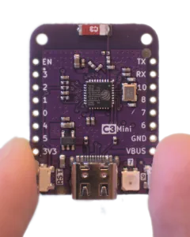

Without really knowing anything about it, I recently decided it would be fun to do some embedded development. This is my story,
and it will involve rust, RISC-V, and maybe a little Nix.
It isn't exactly a tutorial, but if you want to pretend that it is then start by ordering yourself a few of
[these](https://www.aliexpress.us/item/3256804553736450.html?spm=a2g0o.cart.0.0.2ef938da0tl9KC&mp=1&gatewayAdapt=glo2usa&_randl_shipto=US) little guys.
Do it now, because they'll take weeks to arrive.

There's [some](https://docs.rust-embedded.org/book/index.html) [good](https://docs.rust-embedded.org/embedonomicon/) [documentation](https://esp-rs.github.io/book/)
for embedded development in rust, but it isn't exactly complete, comprehensive, or fully up-to-date.
Examples are a different story, though.
Like, [here](https://github.com/esp-rs/esp-hal/tree/main/esp32c3-hal/examples) are examples
for the ESP32C3, the processor I'll be using. There are more than 30 of them covering a bunch of different stuff, and they're stunningly up-to-date. (And
that's only one of 6 architectures maintained in that repo!)
I did run into a few issues that weren't covered by examples I could find, though, and so part of the goal of this series
is to write my problems (and solutions!) down somewhere that I can find them in six months.

The hero of our saga is this LOLIN C3 Mini v2.1.0 board, available on
[AliExpress](https://www.aliexpress.us/item/3256804553736450.html?spm=a2g0o.cart.0.0.2ef938da0tl9KC&mp=1&gatewayAdapt=glo2usa&_randl_shipto=US)
for 4 bucks each.



There are some docs [here](https://www.wemos.cc/en/latest/c3/c3_mini.html),
including [schematics](https://www.wemos.cc/en/latest/_static/files/sch_c3_mini_v2.1.0.pdf)
and a link to the [ESP32-C3 datasheet](https://www.espressif.com/sites/default/files/documentation/esp32-c3_datasheet_en.pdf).
One of the recurring themes in this series of posts is that I don't really know
how to read this kind of documentation.

# First look

The biggest thing on this small board is the USB-C connector in the middle of the bottom edge.
To its right is an LED, marked with a `7`. The two bottom corners are taken up by two small buttons;
the one on the left is marked `RST` and the one on the right is marked `9`. More on those later.

The ESP32-C3 comes with integrated USB-to-JTAG support, meaning that you can flash and debug it without any
extra hardware. In this board, this functionality is hooked up
directly to the USB port, so you can get started with an ordinary USB-C cable.
(We'll see later what implications this has if you want to use the USB port for other stuff.)
The board is recognized automatically when I hook it up to my computer with a USB-C cable:

```
❯ dmesg
<...>
usb 1-2.1: New USB device found, idVendor=303a, idProduct=1001, bcdDevice= 1.01
usb 1-2.1: New USB device strings: Mfr=1, Product=2, SerialNumber=3
usb 1-2.1: Product: USB JTAG/serial debug unit
usb 1-2.1: Manufacturer: Espressif
<...>
```

# Permission to flash

Before we can actually write to the flash chip, we'll need to convince Linux to give us the necessary permissions
on the USB device. `probe-rs` has some [docs](https://probe.rs/docs/getting-started/probe-setup/) for setting
this up on "normal" Linux distributions. I'm using NixOS, though, which always has to be a little special.
To configure the flasher's permissions on `NixOS`, add the following to your system configuration:

```nix
# Note that I'm not using `services.udev.extraRules`, because those rules go
# in `99-local.rules` and `uaccess` needs to be set before that. I learned this
# from https://github.com/NixOS/nixpkgs/issues/210856; see also
# https://enotty.pipebreaker.pl/2012/05/23/linux-automatic-user-acl-management/ for
# more about how the uaccess tag works.
services.udev.packages = [
  (pkgs.writeTextFile {
    name = "embedded-udev-rules";
    text = ''
      ATTRS{idVendor}=="303a", ATTRS{idProduct}=="1001", TAG+="uaccess"
    '';
    destination = "/etc/udev/rules.d/69-probe.rules";
  })
];
```

I wonder how hard it would be to get this added to `nixpkgs`...

# Hello, world!

If you're running Nix, you can get everything you need from [this](https://github.com/jneem/esp-template/) template.
It contains a flake for setting up a rust toolchain and `espflash` (a tool for flashing stuff to our esp).
It also has a `.cargo/config.toml` that I lifted from [here](https://github.com/esp-rs/esp-template) and a
`.helix/languages.toml` that gets rid of some spurious diagnostics (if you use helix).

Entering the Nix shell however you like to do that (I use direnv) and running `cargo run` should be all
you need to do. (The `.cargo/config.toml` file has some configuration to make `cargo run` flash the board using
`espflash`.)

```
❯ cargo run
Serial port: /dev/ttyACM0
Connecting...

Chip type:         ESP32-C3 (revision 3)
Crystal frequency: 40MHz
Flash size:        4MB
Features:          WiFi
MAC address:       68:67:25:b7:49:18
App/part. size:    185920/4128768 bytes, 4.50%
<...>
Hello ESP32-C3!
```

# Blinky

Next up: make the little led flash. Flashing leds are great because unlike the "hello world" example, you
really see that something is happening physically on the device.
Fortunately, `esp-hal` has an [example](https://github.com/esp-rs/esp-hal/blob/696b21bd92737f8e220a1b40bad448abecd090d3/esp32c3-hal/examples/blinky.rs)
for this. So let's copy it over to our `esp-template` and run it:

```
❯ cargo run --bin blinky
Serial port: /dev/ttyACM0
Connecting...

<...>
```

Ok, it runs but I don't see blinking. Let's look at the file we copied over:

```rust
//! Blinks an LED
//!
//! This assumes that a LED is connected to the pin assigned to `led`. (GPIO5)
```

Ah, but our board's [documentation](https://www.wemos.cc/en/latest/c3/c3_mini.html) says that
the LED is on GPIO7, not 5. Changing the 5 to a 7, and...

```
❯ cargo run --bin blinky
Serial port: /dev/ttyACM0
Connecting...

<...>
```

Still nothing. To be continued...
