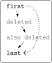
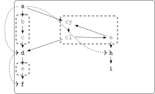
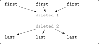

DRAFT

The goal of this post is to describe pseudo-edges: what they are, how to
compute them efficiently, and how to update them efficiently upon small
changes. To recall the important points from the
[last post]({{ site.baseurl }}):

- We (pretend, for now that we) represent the state of the repository as a
  graph in memory: one node for every line, with a directed edges that enforce
  ordering constraints between two lines. Each line has a flag that says
  whether it is deleted or not.
- The *current output* of the repository consists of just those nodes that
  are not deleted, and there is an ordering constraint between two nodes if
  there is a path in the graph between them, *but note that the path is allowed
  to go through deleted nodes*.
- Applying a patch to the repository is very efficient: the complexity of applying
  a patch is proportional to the number of changes it makes.
- Rendering a the current output to a file is potentially very expensive: its
  complexity requires traversing the entire graph, *including nodes that are
  marked as deleted*. To the extent we can, we'd like to reduce this
  complexity to the number of live nodes in the graph.

The main idea for solving this is to add "pseudo-edges" to the graph: for every
path that connects two live nodes through a sequence of deleted nodes, add
a corresponding edge to the graph. Once this is done, we can render the current
output without traversing the deleted parts of the graph, because every
ordering contraint that used to depend on some deleted parts is now represented
by some pseudo-edge. Here's an example: the deleted nodes are in gray, and the
pseudo-edge that they induce is the dashed arrow.

We haven't really solved anything yet, though: once we have the pseudo-edges,
we can efficiently render the output, but how do we compute the pseudo-edges?
The naive algorithm (look at every pair of live nodes, and check if they're
connected by a path of deleted nodes) still depends on the number of deleted
nodes. Clearly, what we need is some sort of *incremental* way to update the
pseudo-edges.

# Deferring pseudo-edges

The easiest way that we can reduce the amount of time required for computing
pseudo-edges is simply to do it rarely. Specifically, remember that
applying a patch can be very fast, and that pseudo-edges only need to be
computed when outputting a file. So, obviously, we should only update the
pseudo-edges when it's time to actually output the file. This sounds trivial,
but it can actually be significant. Imagine, for example, that you're cloning a
repository that has a long history; let's say it has `n` patches, each of which
has a constant size, and let's assume that computing pseudo-edges takes time
`O(m)`, where `m` is the size of the history. Cloning a repository involves
downloading all of those patches, and then applying them one-by-one. If we
recompute the pseudo-edges after every patch application, the total amount of
time required to clone the repository is `O(n^2)`; if we apply all the patches
first and only compute the pseudo-edges at the end, the total time is `O(n)`.

You can see how `ojo` implements this deferred pseudo-edge computation
[here](https://github.com/jneem/ojo/blob/a02daf4df387b407f6c8d0b7237472e5960344dd/libojo/src/lib.rs#L391):
first, it applies all of the patches; then it
[recomputes the pseudo-edges](https://github.com/jneem/ojo/blob/a02daf4df387b407f6c8d0b7237472e5960344dd/libojo/src/lib.rs#L416).

# Connected deleted components

Deferring the pseudo-edge computation certainly helps, but we'd also like to
speed up the computation itself. The main idea is to avoid unnecessary
recomputation by only examining parts of the graph that might have actually
changed.  At this point, I need to admit that I don't know whether what I'm
about to propose is the best way of updating the pseudo-edges. In particular,
its efficiency rests on a bunch of assumptions about what sort of graphs we're
likely to encounter. I haven't made any attempt to test these assumptions on
actual large repositories (although that's something I'd like to try in the
future).

The main assumption is that while there may be many deleted nodes, they tend to
be collected into a large number of connected components, each of which tends
to be small. What's more, each patch (I'll assume) tends to only affect a small
number of these connected components. In other words, the plan will be:

- keep track (incrementally) of connected components made up of deleted nodes,
- when applying or reverting a patch, figure out which connected components
  were touched, and only recompute paths among the live nodes that are on the
  boundary of one of the dirty connected components.

Before talking about algorithms, here are some pictures that should help
unpack what it is that I actually mean. Here is a graph containing three
connected components of deleted nodes (represented by the rounded rectangles):

When I delete node `h`, it gets added to one of the connected components,
and I can update relevant pseudo-edges without looking at the other two connected
components:

If I delete node `d` then it will cause all of the connected components to
merge:

This isn't hard to handle, it just means that we should run our
pseudo-edge-checking algorithm on the merged component.

# Maintaining the components

To maintain the partition of deleted nodes into connected components, we use a
[disjoint-set](https://en.wikipedia.org/wiki/Disjoint-set_data_structure) data
structure.
This is very fast (pretty close to constant time) when applying patches,
because applying patches can only enlarge deleted components.  It's slower when
reverting patches, because the disjoint-set algorithm doesn't allow splitting:
when reverting patches, connected components could split into smaller ones.
Our approach is to defer the splitting: we just mark the original connected component
as dirty. When it comes time to compute the pseudo-edges, we explore the original
component, and figure out what the new connected pieces are.

The disjoint-set data structure is implemented in the
[`ojo_partition`](https://github.com/jneem/ojo/tree/master/partition)
subcrate. It appears in the
[`Graggle` struct](https://github.com/jneem/ojo/blob/a02daf4df387b407f6c8d0b7237472e5960344dd/libojo/src/storage/graggle.rs#L117);
note also the `dirty_reps` member: that's for keeping track of which parts in
the partition have been modified by a patch and require recomputing
pseudo-edges.

We recompute the components
[here](https://github.com/jneem/ojo/blob/a02daf4df387b407f6c8d0b7237472e5960344dd/libojo/src/storage/graggle.rs#L417).
Specifically, we consider the subgraph consisting only of nodes that belong
to one of the dirty connected components. We run Tarjan's algorithm on that
subgraph to find out what the new connected components are. On each of those
components, we recompute the pseudo-edges.

# Recomputing the pseudo-edges

The algorithm for this is: after deleting the node, look at the deleted connected
component that it belongs to, including the "boundary" consisting of live nodes:

Using depth-first search, check which of the live boundary nodes (in this case,
just `a` and `i`) are connected by a path within that component (in this case,
they are). If so, add a pseudo-edge.  The complexity of this algorithm is
`O(nm)`, where `n` is the number of boundary nodes, and `m` is the total number
of nodes in the component, including the boundary (because we need to run `n`
DFSes, and each one takes `O(m)` time). The hope here is that `m` and `n` are
small, even for large histories.  For example, I hope that `n` is almost always
2; at least, this is the case if the final live graph is totally ordered.

This algorithm is implemented
[`here`](https://github.com/jneem/ojo/blob/a02daf4df387b407f6c8d0b7237472e5960344dd/libojo/src/storage/graggle.rs#L479).

# Unapplying, and pseudo-edge reasons

There's one more wrinkle in the pseudo-edge computation, and it has to do with
reverting patches: if applying a patch created a pseudo-edge, removing a patch
might cause that pseudo-edge to get deleted. But we have to be very careful
when doing so, because a pseudo-edge might have multiple reasons for existing.
You can see why in this example from before:

The pseudo-edge from `a` to `d` is caused independently by the both the
`b -> c` component and the `cy -> cl -> e` component. If by unapplying
some patch we destroy the `b -> c` component but leave the `cy -> cl -> e`
component untouched, we have to be sure not to delete the pseudo-edge from
`a` to `d`.

The solution to this is to track to "reasons" for pseudo-edges, where each
"reason" is a deleted connected component. This is a many-to-many mapping
between connected deleted components and pseudo-edges, and it's stored in the
`pseudo_edge_reasons` and `reason_pseudo_edges` members of the
[`GraggleData` struct](https://github.com/jneem/ojo/blob/a02daf4df387b407f6c8d0b7237472e5960344dd/libojo/src/storage/graggle.rs#L117).
Once we store pseudo-edge reasons, it's easy to figure out when a pseudo-edge
needs deleting: whenever its
[last reason becomes obsolete](https://github.com/jneem/ojo/blob/a02daf4df387b407f6c8d0b7237472e5960344dd/libojo/src/storage/graggle.rs#L372).

# Pseudo-edge spamming: an optimization

We've finished describing `ojo`'s algorithm for keeping pseudo-edges up to date,
but there's stil room for improvement. Here, I'll describe a potential optimization
that I haven't implemented yet. It's based on a simple, but non-quite-correct,
algorithm for adding pseudo-edges incrementally:
every time you mark a node as deleted, add a pseudo-edge
from each of its in-neighbors to each of its out-neighbors. I call this
"pseudo-edge spamming" because it just eagerly throws in as many pseudo-edges
as needed.  In pictures, if we have this graph

and we delete the "deleted" line, then we'll add a pseudo-edge from the
in-neighbor of "deleted" (namely, "first") to the out-neighbor of "deleted"
(namely, "last").

This algorithm has two problems. The first is that it isn't complete: you
might also need to add pseudo-edges when adding an edge where at least
one end is deleted. Consider this example, where our graph consists
of two disconnected parts.

If we add an edge from "deleted 1" to "deleted 2", clearly we also need to add
a pseudo-edge between each of the "first" nodes and each of the "last" nodes.
In order to handle this case, we really do need to explore the deleted connected
component (which could be slow).

The second problem with our pseudo-edge spamming algorithm is that it
doesn't handle *reverting* patches: it only describes how to add pseudo-edges,
not delete them.

The nice thing about pseudo-edge spamming is that even if it isn't completely
correct, it can be used as a fast-path in the correct algorithm: when applying
a patch, if it modifies the boundary of a deleted connected component that
isn't already dirty, use pseudo-edge spamming to update the pseudo-edges
(and don't mark the component as dirty). In every other case, fall back to
the previous algorithm.
